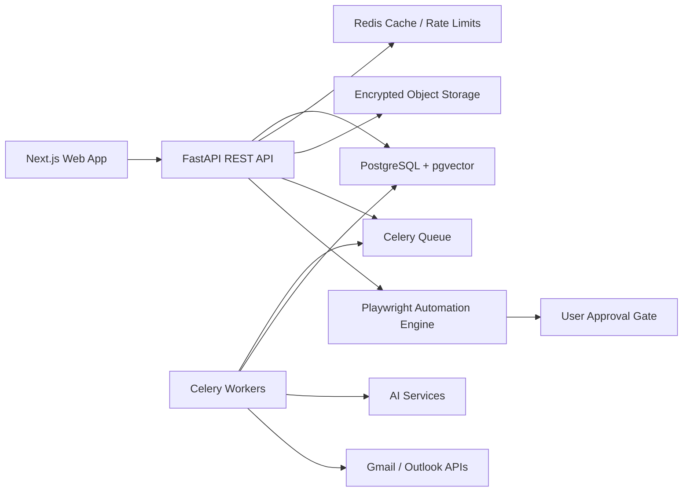
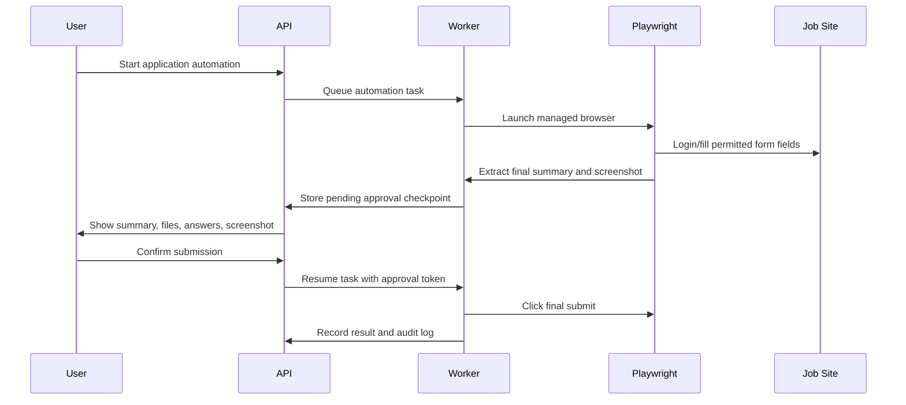

# Architecture

AutoApply AI uses a modular monorepo with independently deployable API, worker, and web applications.

## Design Decisions

- **Clean architecture:** API routers are thin; services own business rules; repositories own persistence; unit-of-work controls transactions.
- **Pluggable connectors:** job sources implement a common `JobConnector` contract so new providers do not require core matching changes.
- **Async backend:** FastAPI and SQLAlchemy async support high concurrency for IO-heavy SaaS traffic.
- **Queue-first heavy work:** parsing, embeddings, job discovery, matching, email sync, notification delivery, and automation runs move to workers.
- **Safety by construction:** the automation engine has a mandatory approval checkpoint before any submit action.
- **Provider boundaries:** AI prompts live in independent services and must use candidate-provided facts only.

## Scale Model

- API services scale horizontally behind Nginx or an application load balancer.
- Workers scale by queue type: parsing, AI generation, job discovery, email sync, automation.
- PostgreSQL stores transactional data; pgvector stores embeddings for jobs and profiles.
- Redis handles rate limits, cache-aside reads, short-lived idempotency keys, and Celery transport.
- Object storage holds encrypted resumes, generated versions, screenshots, and audit artifacts.

## Automation Sequence

