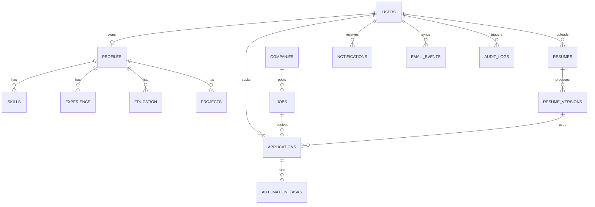

# Database Schema

The transactional schema is normalized for application workflows. Embedding columns and pgvector indexes should be added once production embedding dimensions are finalized for the selected OpenAI embedding model.

